# Application Insight and Power BI
PowerBI is a great tool to visualize telemetry data on Application Insight dynamically, with these reports you can preview real-time visualization of your data.

In this section we'll export Application Insight data which we've collected throgh HockeyApp to PowerBI and visaulize data.

## Visualize Application Insight data with PowerBI

1. Go to Application Insight Portal and put any query to export. We've used customEvents to see all details for our telemetry data, Click Export to "Power BI Query (M)"
    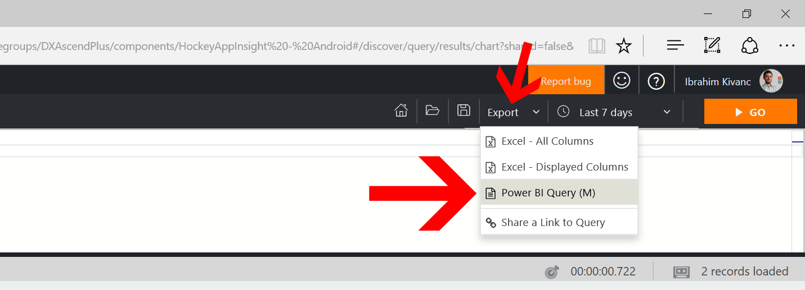

1. Save this query to your desktop to use with PowerBI.
    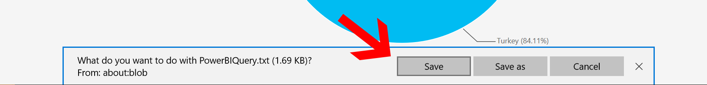

1. Open this query with your text ediyor and copy.
    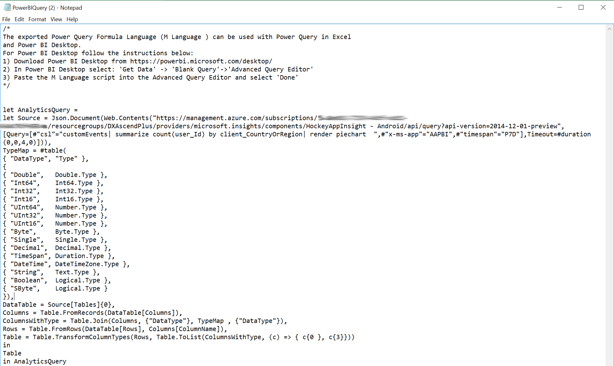

1. After copying this query launch PowerBI Desktop Application, click "GetData" on Tab Menu select "Blank Query".
    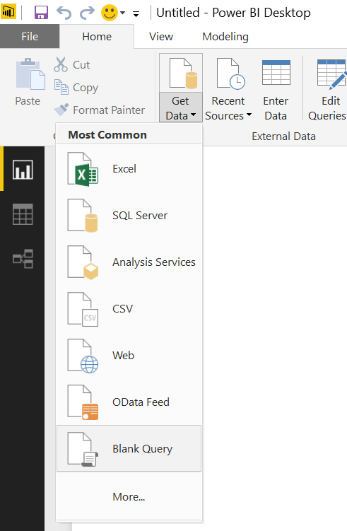

1. Find "Advance Editor" in Pop-Up windows under "View" section on Tab menu.
    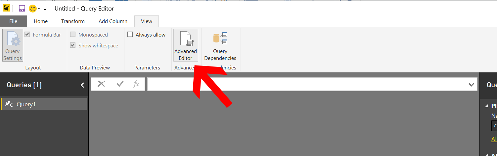

1. Paste your query into this "Advance Editor" Pop-up window.
    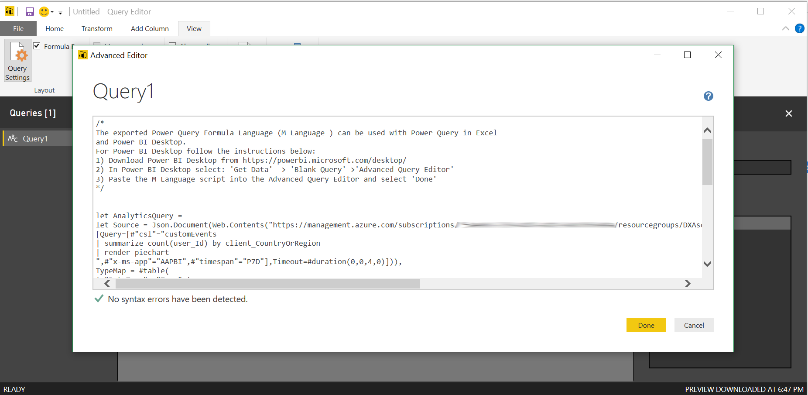

1. If you're connecting this application on your PC, this step will require Azure account verification.
  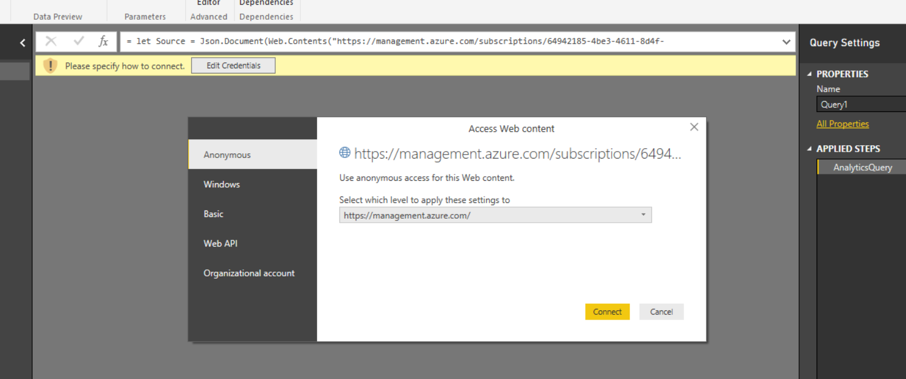

1. To login with your credentials select "Organizational Account" then login. Now your PowerBI can access your Application Insight telemetry data spesific for your application.
    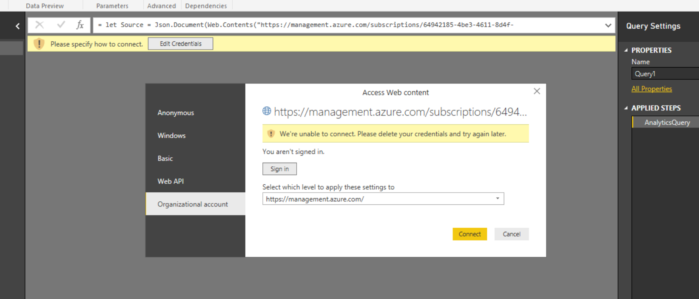

1. After succesfully login into your account via PowerBI. Now Click "Home" section on PowerBI Tab Menu.
    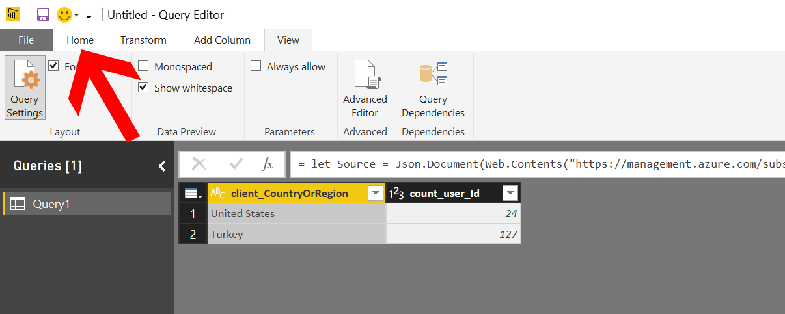

1. Then click "Close & Apply" on Home Section of your tab menu
    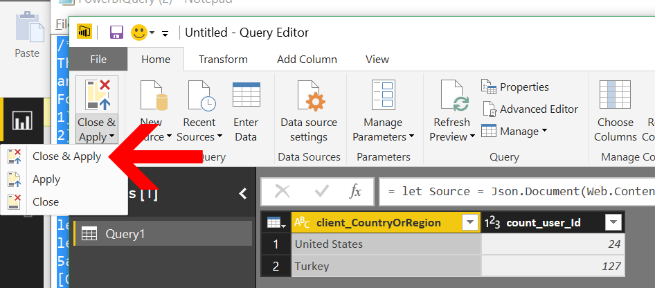

1. After you see your data successfuly in PowerBI, now create some visuals then view as below chart. Whenever there's a new data on your Application Insight, you can refresh your report and see the latest results on your chart.
    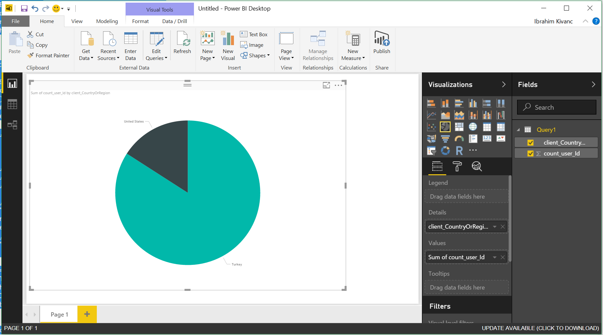

## Additional References
- [Feed Power BI from Application Insights](https://docs.microsoft.com/en-us/azure/application-insights/app-insights-export-power-bi)
- [Interactive Analytics with Application Insights](https://channel9.msdn.com/events/Build/2016/T666)
- [Exploring HockeyApp data in Application Insights](https://docs.microsoft.com/en-us/azure/application-insights/app-insights-hockeyapp-bridge-app)
- [Update: Mobile and Desktop app telemetry experience in Application Insights and HockeyApp](https://azure.microsoft.com/en-us/blog/mobile-and-desktop-telemetry-in-application-insight-and-hockeyapp/)
- [How to use HockeyApp with Visual Studio Team Services (VSTS) or Team Foundation Server (TFS)](https://support.hockeyapp.net/kb/third-party-bug-trackers-services-and-webhooks/how-to-use-hockeyapp-with-visual-studio-team-services-vsts-or-team-foundation-server-tfs)