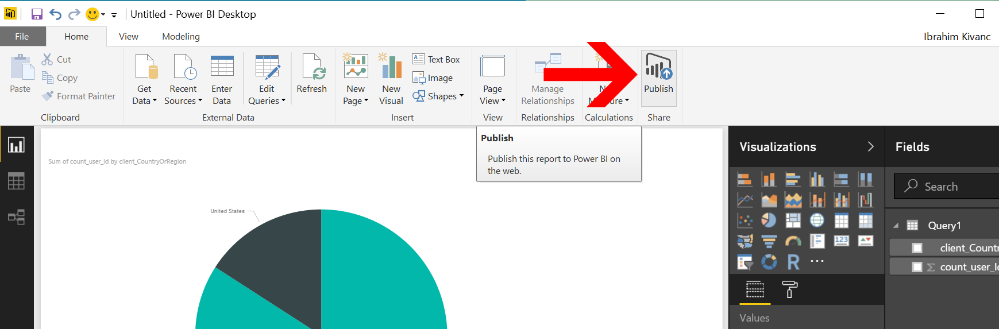
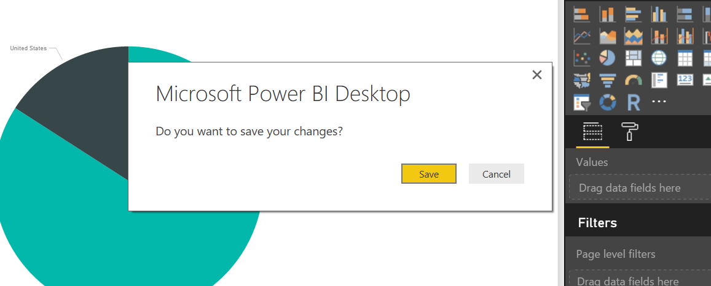
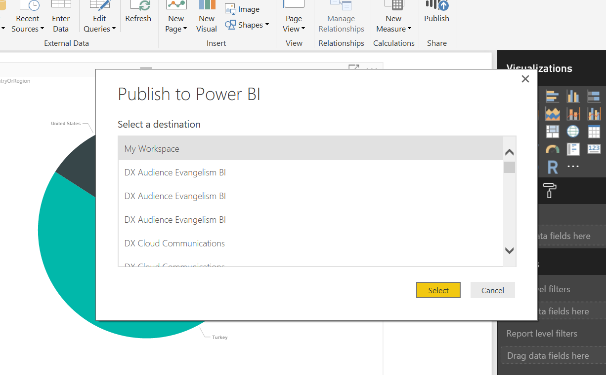
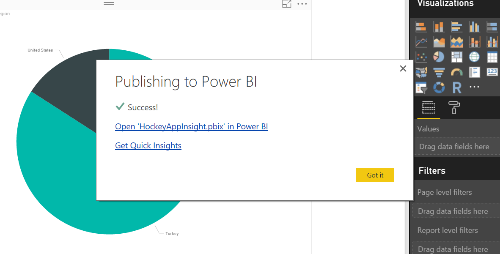
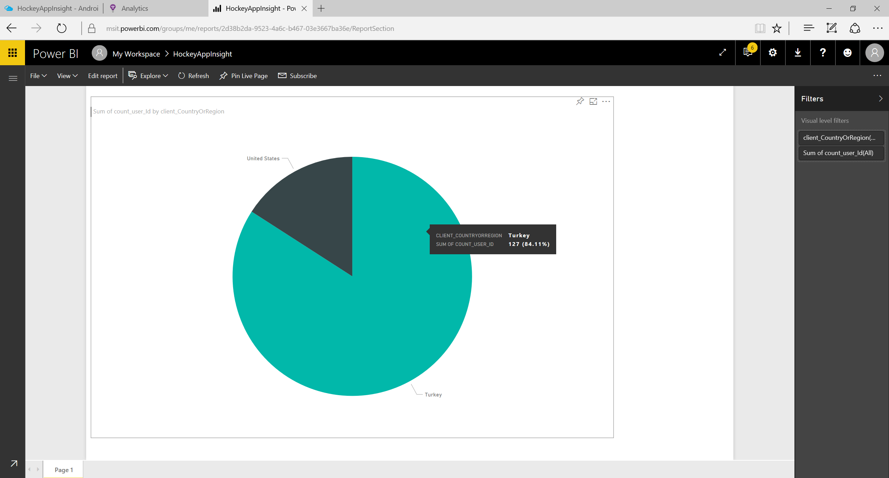

# Publishing Power BI Report 
After creating your visualization on PowerBI Desktop now time to share this report with your collagues and clients. If you have Office 365 account you can publish these reports in that portal and you can view from multiple places, such as SharePoint, Microsoft Team and any place with getting a embedded webview link.

To publish these reports to PowerBI portal you can follow below steps.

## Publishing Power BI Report
1. In Home section of your tab menu click "Publish".
    

1. If this report is not saved on your PC, Save this report into your harddrive as "HockeyAppInsight.pbix"
    

1. After that select a workplace on your PowerBI Portal to publish your report.
    

1. Your report has been successfuly saved on your PowerBI Portal.
    

1. Click "Open 'HockeyAppInsight.pbix' in PowerBI" link on success pop-up message to view Web page.

## Additional Resources
- [PowerBI Anasayfası](http://powerbi.microsoft.com/)
- [Feed Power BI from Application Insights](https://docs.microsoft.com/en-us/azure/application-insights/app-insights-export-power-bi)
- [Interactive Analytics with Application Insights](https://channel9.msdn.com/events/Build/2016/T666)
- [Exploring HockeyApp data in Application Insights](https://docs.microsoft.com/en-us/azure/application-insights/app-insights-hockeyapp-bridge-app)
- [Update: Mobile and Desktop app telemetry experience in Application Insights and HockeyApp](https://azure.microsoft.com/en-us/blog/mobile-and-desktop-telemetry-in-application-insight-and-hockeyapp/)
- [How to use HockeyApp with Visual Studio Team Services (VSTS) or Team Foundation Server (TFS)](https://support.hockeyapp.net/kb/third-party-bug-trackers-services-and-webhooks/how-to-use-hockeyapp-with-visual-studio-team-services-vsts-or-team-foundation-server-tfs)