# Power BI Embedded

If you don't have Office365 or PowerBI account, another way to publish your PowerBI report is "PowerBI Embedded on Azure". To publish these reports on Azure account, you only need to create a PowerBI Embedded Application and publish these reports on top of this.

## Prerequisite
- [Sample workspace web app](http://go.microsoft.com/fwlink/?LinkId=761493)
- [Power BI Embedded API reference](https://msdn.microsoft.com/en-US/library/azure/mt711507.aspx)
- [Power BI Embedded .NET SDK (available via NuGet)](http://go.microsoft.com/fwlink/?LinkId=746472)
- [JavaScript Report Embed Sample](https://microsoft.github.io/PowerBI-JavaScript/demo)

## Embedding Power PowerBI Report into Web Application

Let's use the PowerBI report we've created in below steps. We'll embed this report into a sample web application.

1. Save your 'HockeyAppInsight' PowerBI report into a path you'll access later. In this demo I used "C:\D\PowerBI\HockeyAppInsight.pbix" path.
    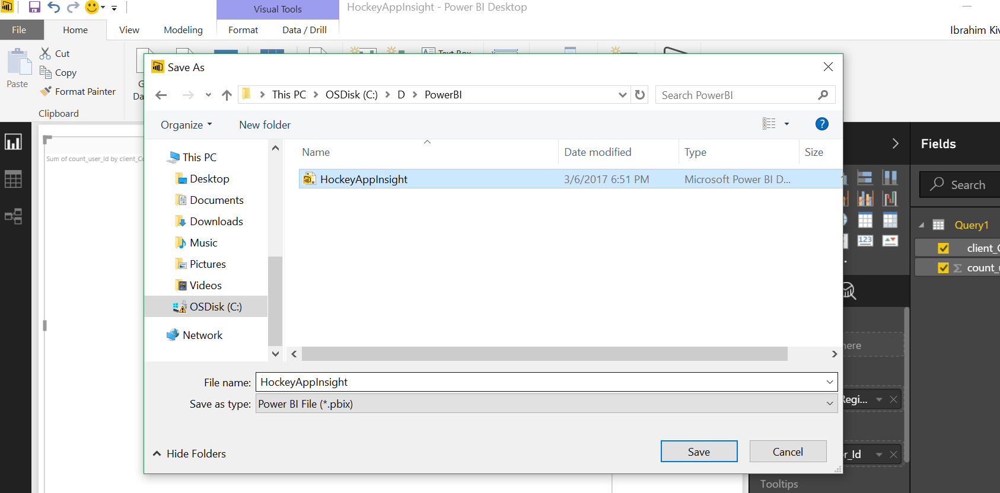	

1. Go to Azure Portal, create a PowerBI Embbedded application using select "Power BI Embedded", under "Intelligence + Anaytics" then give a Workspace Collection Name.
	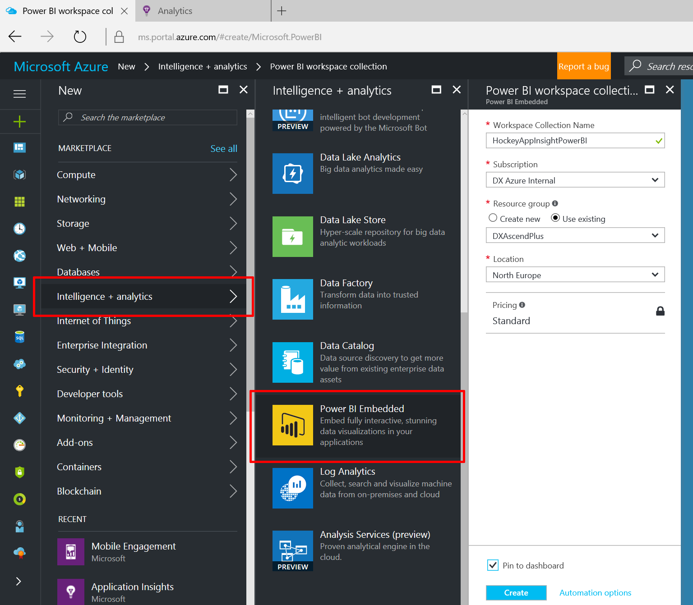	

1. Go and download [Sample workspace web app](http://go.microsoft.com/fwlink/?LinkId=761493) solution on your local and "Rebuild" project to get nugget packages successfuly to run your application. After that select "ProvisionSample" project as a default application as "Set as  Startup Project"
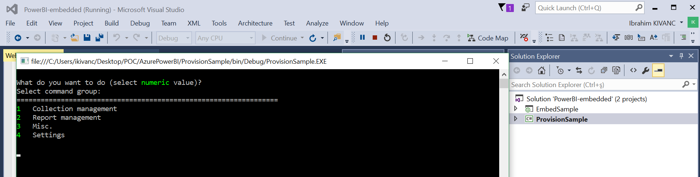	

1. After running application there'll be a consome application, we'll manage our PowerBI Embedded worksplace which is hosted on Azure. Let's select "1" to pick "Collection Management". Then "4" command for "Provision a new Workspace Collection".
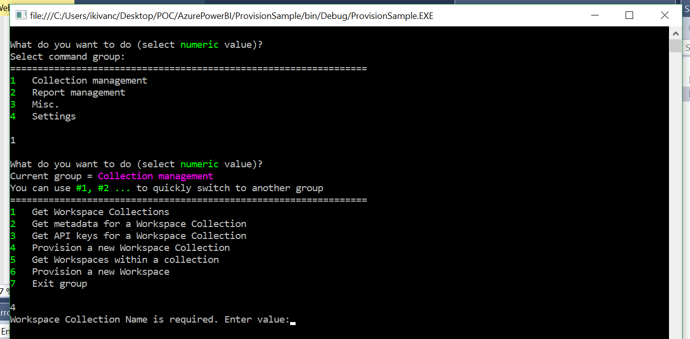	

1. Then we'll put our PowerBI Embedded on Azure workspace info, "WorkSpace Collection Name" , Resource Group and Subscription ID info into console application.
	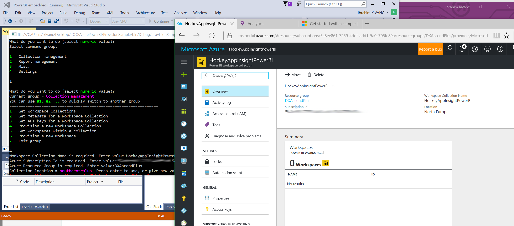	
	
1. Then get the "Access Key" from PowerBI Embedded project.
	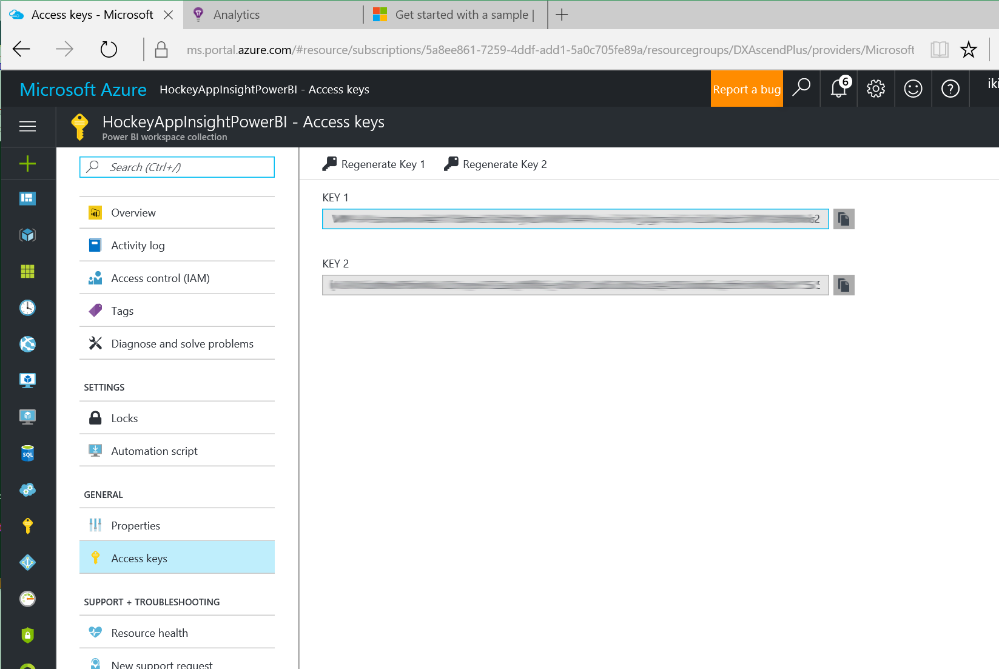	
	

1. After putting these info into console applcation, we'll see our our workspace ID on console screen succesfuly.
	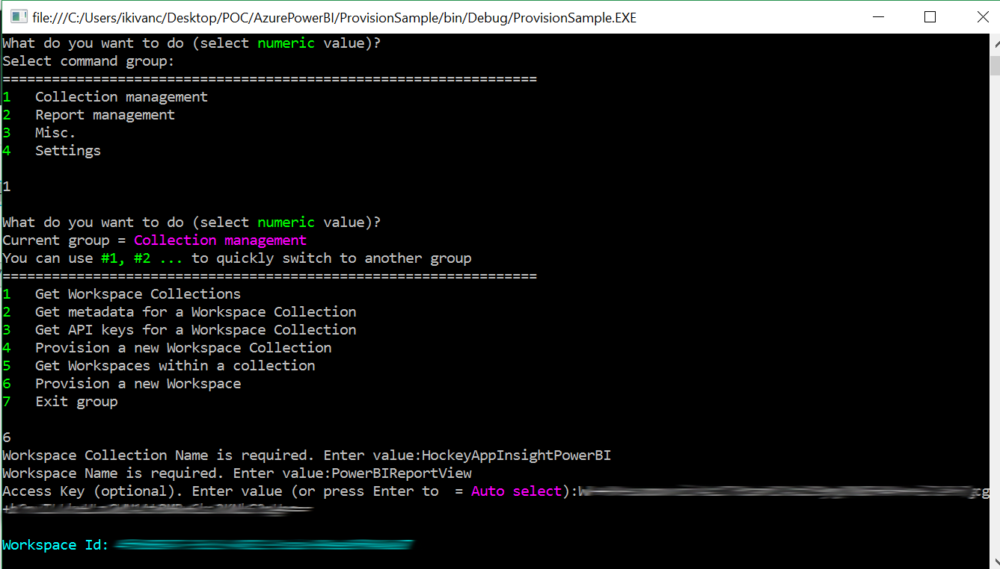	

1. When we go to Azure Portal, WorkSpaces section of our PowerBI Embedded project we can see Workspace Name and Workspace ID.
	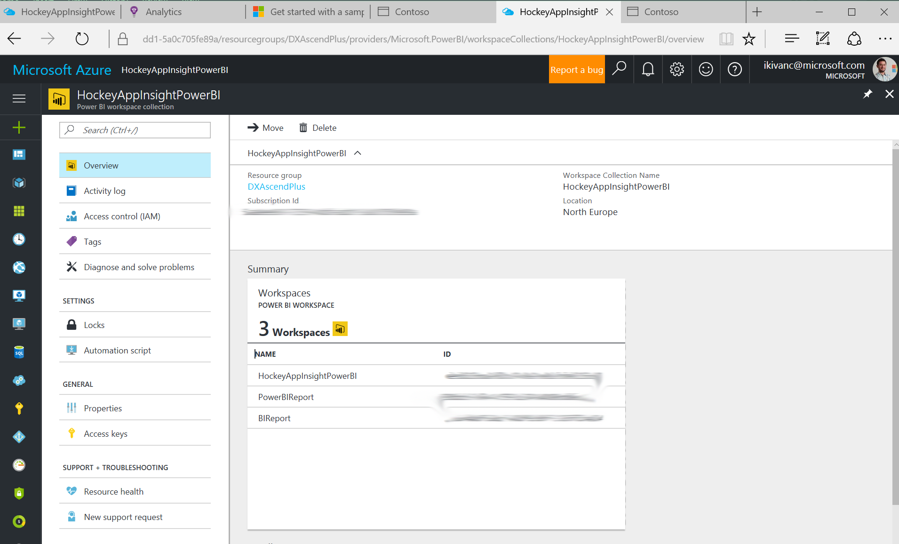	

1. In this step, we'll upload our Power BI PBIX file onto Azure Power BI Embedded workspace.
For this select "7" to exit from "Collection" section. Then type 2 to pick "Report Management" section. 
	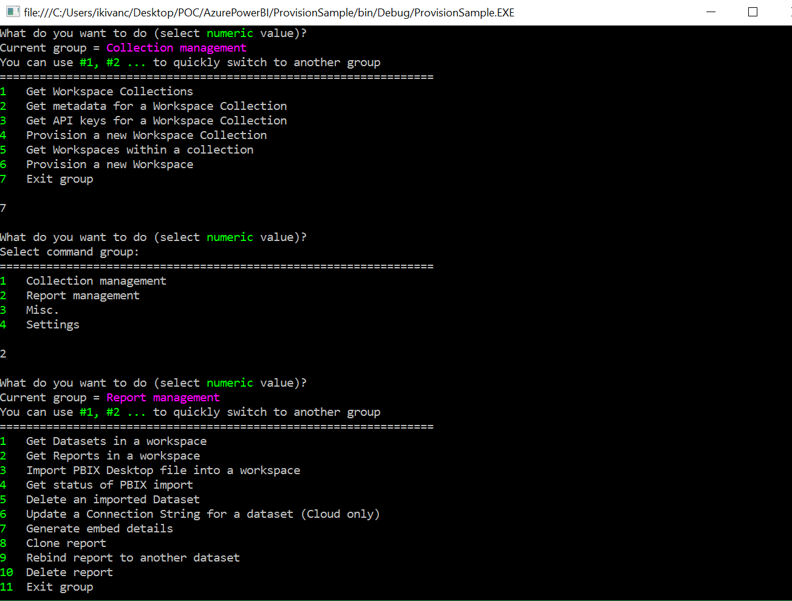	

1. Select "3" to "Import PBIX Desktop file into a workspace", Enter your "Workspace Collection Name" then enter your "Workspace Id", Dataset Name you'll give then enter path of pbix file on console windows.
	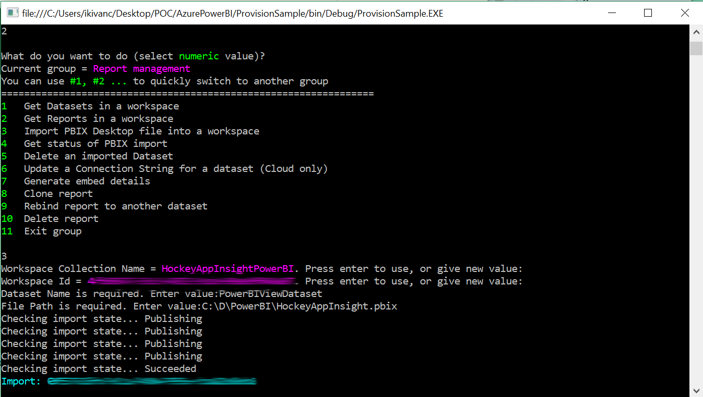	

1. When it's uploaded successfuly,you'll see "Succeeded" message on console screen.

1. We'll do last changes in Web Config file of the solution you've downloaded from [Sample workspace web app](http://go.microsoft.com/fwlink/?LinkId=761493). We'll update keys with "AccessKey", "WorkSpaceCollection", "WorkspaceID" . After changes our webconfig will be like below. 
    ```xml
    <appSettings file="Cloud.config">
        <add key="powerbi:AccessKey" value="YOUR POWERBI EMBEDDED ACCESS KEY WILL BE HERE"/>
        <add key="powerbi:WorkspaceCollection" value="HockeyAppInsightPowerBI"/>
        <add key="powerbi:WorkspaceId" value="YOUR POWERBI WORKSPACEID WILL BE HERE"/>
        <add key="powerbi:ApiUrl" value="https://api.powerbi.com"/>
    </appSettings>
    ```

1. Now set your website project as your default project of your solution in Visual Studio. When you run the application your screen will look like below dashboard screen of your demo web application. You can access the report with clicking your project link.

	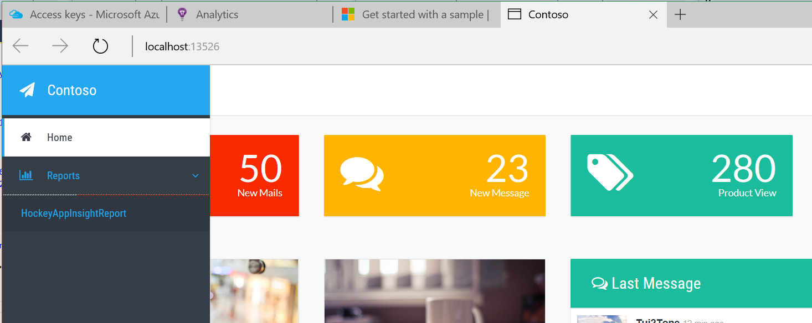

1. After clicking your web link of your PowerBI report, report will look like below. You can do some changes via clicking settings on the right panel. 
	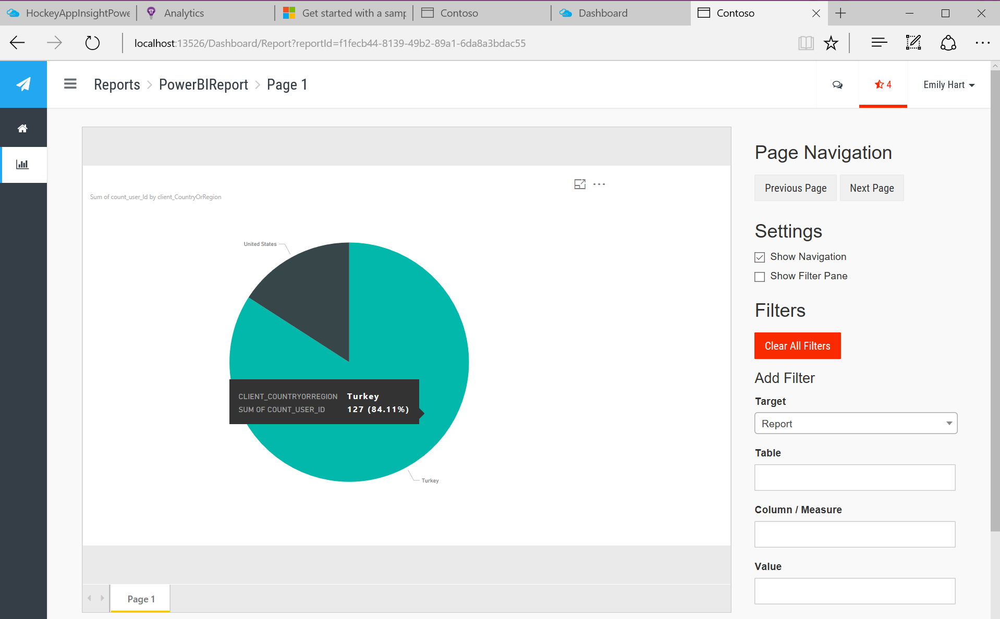

## Additional Resources
- [PowerBI Home Page](http://powerbi.microsoft.com/)
- [Feed Power BI from Application Insights](https://docs.microsoft.com/en-us/azure/application-insights/app-insights-export-power-bi)
- [Interactive Analytics with Application Insights](https://channel9.msdn.com/events/Build/2016/T666)
- [Exploring HockeyApp data in Application Insights](https://docs.microsoft.com/en-us/azure/application-insights/app-insights-hockeyapp-bridge-app)
- [Update: Mobile and Desktop app telemetry experience in Application Insights and HockeyApp](https://azure.microsoft.com/en-us/blog/mobile-and-desktop-telemetry-in-application-insight-and-hockeyapp/)
- [How to use HockeyApp with Visual Studio Team Services (VSTS) or Team Foundation Server (TFS)](https://support.hockeyapp.net/kb/third-party-bug-trackers-services-and-webhooks/how-to-use-hockeyapp-with-visual-studio-team-services-vsts-or-team-foundation-server-tfs)